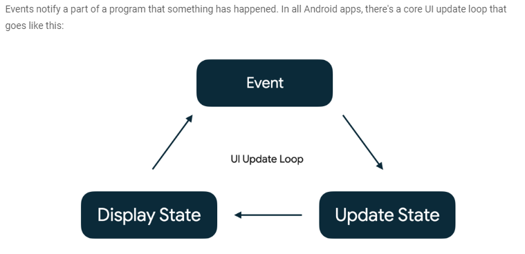

# State in Compose

- State is anything that can change over time and needs to be remembered and presented to the user through UI.
- State can can range from a variable to a DB.
- Any action that causes the modification of state is called an "event".
- Events are inputs generated from outside or inside an application, such as:
	- The user interacting with the UI by, for example, pressing a button.
	- Other factors, such as sensors sending a new value, or network responses.

- While the state of the app offers a description of what to display in the UI, events are the mechanism through which the state changes, resulting in changes to the UI.

- Event - An event is generated by the user or another part of the program.
- Update State - An event handler changes the state that is used by the UI.
- Display State - The UI is updated to display the new state.
